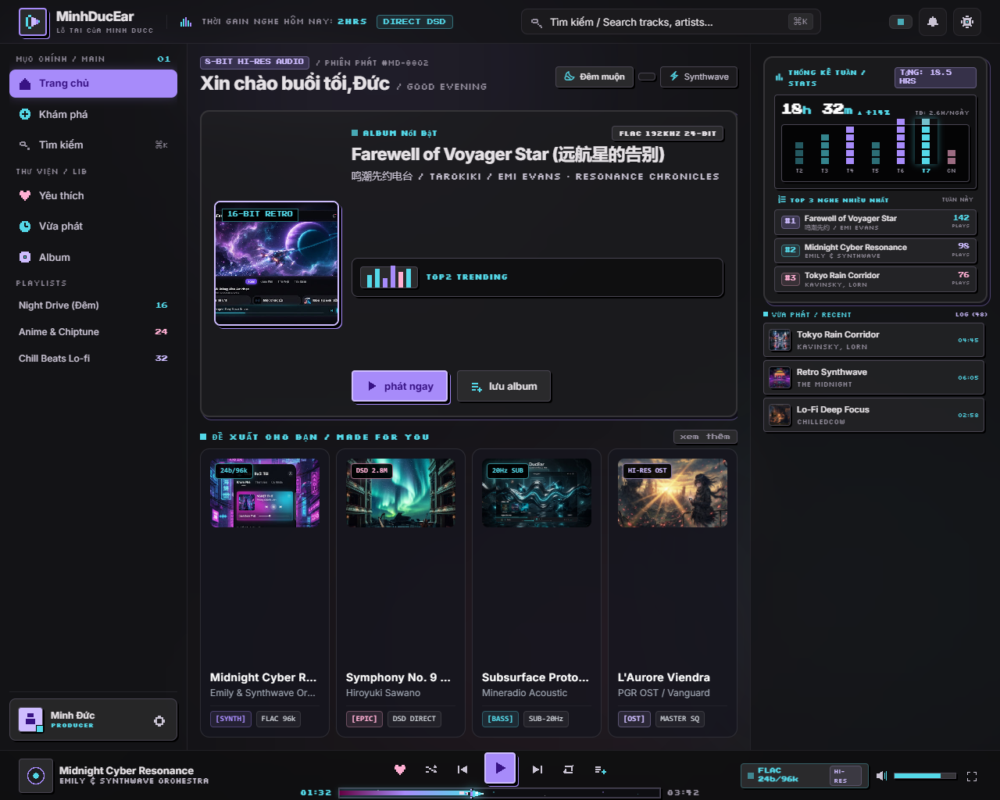

# 🎵 MinhDucEar - Web Music Streaming Platform

MinhDucEar là ứng dụng nghe nhạc trực tuyến hiện đại được xây dựng trên nền tảng **PHP & JavaScript**, tích hợp phát nhạc chất lượng cao từ **YouTube Music API**, đồng bộ lời bài hát thời gian thực (LRC Karaoke) và hỗ trợ cơ chế tự phục hồi luồng nhạc thông minh khi gặp sự cố bản quyền.



## ✨ Tính Năng Nổi Bật

- 🎧 **Phát Nhạc Trực Tuyến & Tự Phục Hồi (Self-Healing Stream)**: Tự động phát hiện và chuyển đổi dự phòng thông minh khi video YouTube bị giới hạn nhúng, đảm bảo trải nghiệm nghe nhạc liên tục không bị gián đoạn.
- 🎤 **Đồng Bộ Lời Bài Hát (Floating Karaoke Pill & Fullscreen)**: Hiển thị lời bài hát đồng bộ thời gian thực theo từng giây (LRC format) với giao diện dạng viên thuốc gọn gàng hoặc chế độ toàn màn hình.
- 🔍 **Tìm Kiếm & Khám Phá Nhanh Chóng**: Tích hợp phím tắt toàn cầu `Ctrl + K`, tìm kiếm bài hát, nghệ sĩ, album từ kho nhạc YouTube Music phong phú.
- 📂 **Danh Sách Phát Đa Dạng (Curated Playlists & Albums)**:
  - Khám phá các playlist tuyển chọn theo chủ đề (Thư giãn, Năng lượng, Top Trending, My Supermix).
  - Bung ra giao diện chi tiết playlist/album trực quan với đầy đủ danh sách bài hát, ảnh bìa và điều khiển phát nhạc.
  - Hỗ trợ tạo và quản lý danh sách phát cá nhân hóa (lưu trữ LocalStorage + Database).
- 🎨 **Giao Diện Hiện Đại & Tinh Tế**:
  - Thiết kế theo phong cách Dark Mode hiện đại (Material Design / Tailwind CSS).
  - Thẻ nhạc vuông vức chuẩn album (`aspect-square`), loại bỏ 100% viền đen từ thumbnail YouTube.
  - Trình phát Player đáy đầy đủ tính năng: đĩa than xoay mượt mà, thanh tua thời gian chuẩn xác, điều chỉnh âm lượng và chế độ phát (lặp lại, ngẫu nhiên).

## 🛠️ Công Nghệ Sử Dụng

- **Frontend**: HTML5, CSS3, Tailwind CSS, Vanilla JavaScript (ES6+ Modules), YouTube IFrame Player API.
- **Backend**: PHP (RESTful APIs), cURL cho YouTube Music InnerTube scraper & Musixmatch API.
- **Database**: MySQL / MariaDB (hỗ trợ cấu hình tích hợp Google Firebase Firestore).
- **Web Server**: Apache (XAMPP).

## 🚀 Cài Đặt & Chạy Cục Bộ

1. **Yêu cầu hệ thống**:
   - XAMPP (Apache & MySQL) phiên bản PHP 7.4 trở lên.
   - Trình duyệt web hiện đại (Chrome, Edge, Firefox).

2. **Cài đặt dự án**:
   - Sao chép mã nguồn vào thư mục `htdocs` của XAMPP:
     ```bash
     git clone git@github.com:binhpham0725/MinhDucEar.git C:/xampp/htdocs/MinhDucEar
     ```
   - Khởi động **Apache** và **MySQL** trong XAMPP Control Panel.
   - Nhập cơ sở dữ liệu từ file `database.sql` hoặc truy cập `database/init_db.php` để khởi tạo tự động.

3. **Trải nghiệm ứng dụng**:
   - Mở trình duyệt và truy cập: `http://localhost/MinhDucEar/pages/index.php`

---
© 2026 MinhDucEar. Developed by binhpham0725.
